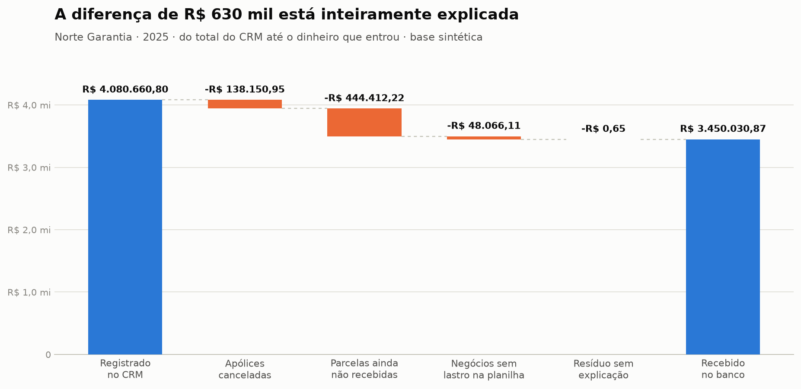

# auditoria-comissoes

> **A diretoria acha que sumiram R$ 630 mil de comissão. Não sumiu nada.** O CRM e o financeiro medem a mesma operação com réguas diferentes, e este projeto reconstrói a conta até o último centavo para mostrar onde cada real foi parar.


<picture>
  <source media="(prefers-color-scheme: dark)" srcset="docs/grafico-dark.png">
  
</picture>

> A quarta barra parece faltar, e não falta: o resíduo é de **R$ 0,65**, alto demais para ser zero e baixo demais para desenhar. É esse o ponto do gráfico. Cada degrau laranja é uma parte da diferença que tem nome e explicação, e o que sobra sem nome não dá nem um pixel.

---

## O problema

Todo mês a mesma cena: alguém abre o relatório do CRM, vê R$ 4,08 milhões de comissão, olha o extrato bancário, vê R$ 3,45 milhões, e pergunta onde foram parar os R$ 630 mil.

Não foram parar em lugar nenhum, porque nunca estiveram lá. O CRM lança o **contrato cheio na data da venda**. O banco recebe **parcela por parcela**, conforme o tomador paga o prêmio. Subtrair um do outro é somar laranja com maçã, e o resultado manda a diretoria caçar um dinheiro que não existe.

O trabalho da auditoria não é achar o dinheiro. É provar que ele não está faltando, e separar disso o que **de fato** está errado.

> **Essa cena não é hipotética.** Ela aconteceu, e a conferência que a resolveu é o que este projeto reconstrói sobre dados sintéticos.

## O que eu fiz

Uma auditoria em três blocos, nessa ordem, sobre a base da [Norte Garantia](https://github.com/Lucasnevesads/base-sintetica-seguros).

**1. Integridade primeiro.** Duas conferências que precisam fechar ao centavo: extrato contra demonstrativos, e parcelas recebidas contra demonstrativos. Se falharem, a base não é confiável e nada depois vale. Fecharam em R$ 0,00.

**2. A ponte.** Decompõe a diferença de R$ 630 mil em partes com nome, em vez de acusar alguém. O que sobra sem nome é o que merece investigação.

**3. Os achados.** Seis regras de negócio, cada uma procurando quem a viola.

Três decisões que não eram óbvias:

**A auditoria é proibida de ler o gabarito, e a proibição é código.** A base traz um arquivo dizendo exatamente onde estão os erros. Se a auditoria puder abri-lo, ela não está auditando, está copiando. A lista de fontes permitidas está em `config/fontes.yml`, e quem pedir o gabarito leva uma exceção. A pontuação fica em `src/medir.py`, um arquivo separado que só roda depois.

**A ponte explica, não acusa.** É a diferença entre auditoria e caça às bruxas. Um relatório que diz "faltam R$ 630 mil" está errado e destrói confiança. Um que diz "R$ 444 mil ainda não venceram, R$ 138 mil foram cancelados, R$ 48 mil o financeiro não recebeu" resolve o problema e aponta a única coisa que precisa de ação.

**A conferência de valor casa as bases pelo par (apólice, parcela), não por id.** A planilha do financeiro é digitada a partir do documento, então ela não tem identificador de sistema. Fazer o casamento pelo mesmo caminho que se faz na mão é o que faz a digitação errada aparecer.

## O resultado

**A diferença de R$ 630.629,93 ficou explicada até R$ 0,65**, e esse resíduo é a soma exata das divergências de centavos que a própria auditoria apontou. Nenhum real sem destino.

**24 defeitos encontrados de 24 existentes, sem nenhum falso positivo**, medido depois contra o gabarito:

```
Gabarito: 24 defeitos plantados
Auditoria: 24 apontamentos

  Encontrados       24 de 24   (100%)
  Não encontrados    0
  Falsos positivos   0

Por tipo de defeito:
  tipo                         plantados  achados
  -----------------------------------------------
  cancelada_como_pendente              3        3
  competencia_trocada                  6        6
  consultor_com_espaco                 5        5
  divergencia_de_centavos              8        8
  negocio_so_no_crm                    2        2
```

O relatório completo está em [`saida/relatorio.md`](saida/relatorio.md) e o detalhe linha a linha em [`saida/achados.csv`](saida/achados.csv).

## Como rodar

A base vem de outro projeto. Clone os dois lado a lado:

```bash
git clone https://github.com/Lucasnevesads/base-sintetica-seguros
cd base-sintetica-seguros && pip install -r requirements.txt && python src/gerar_base.py && cd ..

git clone https://github.com/Lucasnevesads/auditoria-comissoes
cd auditoria-comissoes
pip install -r requirements.txt
python src/auditar.py
```

E depois, para pontuar a auditoria contra o gabarito:

```bash
python src/medir.py
```

Se a base estiver em outro lugar, ajuste o caminho em `config/fontes.yml`.

---

## 🔍 Detalhe técnico

### As seis conferências

| Conferência | A regra que ela testa | Achou |
|---|---|---:|
| `competencia_fora_do_mes` | a aba do mês contém a parcela daquele mês | 6 |
| `cancelada_ainda_contando` | boleto cancelado ⇒ comissão cancelada | 3 |
| `consultor_mal_digitado` | nome de consultor sem espaço sobrando | 5 |
| `negocio_sem_lastro` | negócio no CRM tem linha na planilha | 2 |
| `valor_divergente` | valor digitado = valor da parcela | 8 |
| `numero_de_apolice_repetido` | número de apólice é único | 0 |

A última achou zero, e ela existe justamente por isso: se um dia dois contratos tiverem o mesmo número, **todas as outras conferências ficam erradas em silêncio**, porque o casamento entre as bases passa por esse número. Conferência que sempre passa não é inútil, é seguro.

### Por que o número deste projeto (R$ 630 mil) é diferente do outro (R$ 582 mil)

O repositório da base compara o CRM com a tabela de **parcelas do sistema**. Esta auditoria compara o CRM com a **planilha do financeiro**. A diferença entre os dois números é:

```
630.629,93 - 582.563,17 = 48.066,76
```

Que é exatamente `48.066,11` de negócio sem lastro mais `0,65` de divergência de centavos.

Ou seja: **os dois números estão certos, e a distância entre eles é o próprio defeito.** O sistema sabe de R$ 48 mil de comissão que a planilha do financeiro nunca registrou. Se as duas fontes concordassem, não haveria nada para auditar.

### Limitações

- **A auditoria conhece os cinco tipos de defeito porque eu também escrevi a base.** Achar 24 de 24 mede a execução das regras, não a capacidade de descobrir um problema inédito. Uma auditoria de verdade encontra tipo de erro que ninguém tinha catalogado, e isso este projeto não demonstra.
- **A base é limpa demais.** Não há duplicata, campo em branco, encoding quebrado nem data em três formatos diferentes, que é metade do trabalho real.
- **Não há regra de negócio ambígua.** Na vida real a maior parte do tempo vai embora decidindo se uma linha é erro ou exceção legítima, e isso exige conversar com gente, não escrever código.
- **A ponte assume que toda parcela pendente é calendário, não inadimplência.** Distinguir uma da outra exigiria data de vencimento do prêmio, que a base não modela.
- **Dinheiro é `float`.** Herdado da base. Para análise está de bom tamanho; para um sistema que move dinheiro, o certo é decimal com precisão fixa.

---

## 🧪 Sobre os dados

Os dados são da **Norte Garantia**, uma corretora de seguro garantia **fictícia**, gerada em [`base-sintetica-seguros`](https://github.com/Lucasnevesads/base-sintetica-seguros). As seguradoras também são fictícias.

Nenhum dado de cliente ou de empresa real é usado, em nenhuma etapa.

O nome da empresa fica isolado em [`config/empresa.yml`](config/empresa.yml). O código tem uma trava: se alguém mudar `sintetico: true` para `false`, o projeto para de rodar.

---

## 📄 Documentação

- [`docs/decisoes.md`](docs/decisoes.md) · por que cada escolha foi feita, e o que ela custou
- [`saida/relatorio.md`](saida/relatorio.md) · o relatório completo da auditoria
